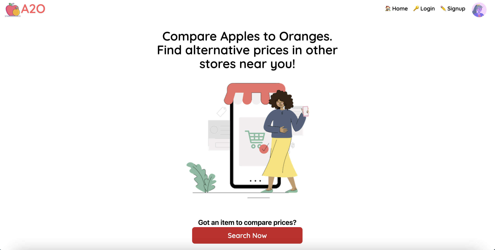
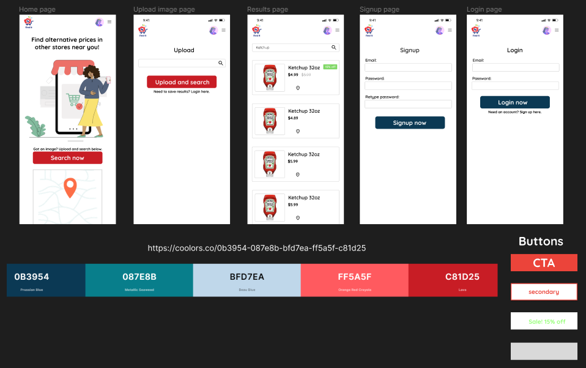

#  Apples to Oranges 

## Created for DeveloperWeek 2023

Our team joined the DeveloperWeek 2023 [Hackathon](https://developerweek-2023-hackathon.devpost.com/), the largest challenge-driven hackathon, co-located with DeveloperWeek 2023. We are competing for the DeveloperWeek 2023 Overall Winner title, which will grant winners a $12,500 USD value prize.

Judging will be based on: 1) PROGRESS: How much progress you make on your submission; 2) CONCEPT: Does your submission solve a real problem?; and 3) FEASIBILITY: Could your submission grow/evolve to become a startup or be a profitable business.

# Project Overview

A2O is a grocery store application inspired by getting the best deal when shopping for groceries. It was created with the savvy shopper in mind, with features such as discount banners, product locations, and a profile page where a user can save their favorite products.

# Real World Application

It is the mission of this application to help users compare prices for the same item at grocery stores near them so they can make an informed decision on where to buy products. Our team was inspired by our own issues with finding the best deals when shopping and developed this app as a potential solution.

## Features

- Home page where user can initiate a product search
- Product page that displays comparable products
- Product details page with location featured on map
- Login/Signup functionality with Firebase
- Profile page with users favorite products
- Tailwind for responsive design

Home Page:




Product Search Page:


Product Details Page:


Signup and Login Pages:


Mobile Views:


## Technologies

**Languages/Frameworks:** React, React Router, Vite, Firebase, Tailwind, MapBox

## Installation

Use the package manager, npm, to install dependencies.

```bash
npm install
```

## Figma Design and Color Theme



We decided to go with a simple design with lots of white background. The color theme is centered around the color red which is a popular color in the food industry.

# Learn More About the Developers

Kailey Kotynski

- **GitHub:** https://github.com/kotynskm
- **LinkedIn:** https://www.linkedin.com/in/kkotynski
- **Medium:** https://medium.com/@k.kotynski
- **Portfolio:** https://kaileykotynski.netlify.app

Vanessa Vun

- **GitHub:** https://github.com/vanessavun
- **LinkedIn:** https://www.linkedin.com/in/vanessavun/
- **Portfolio:** https://vanessavun.tech/

Axel Hurtado
- **GitHub:** https://github.com/axelandreina
- **LinkedIn:** https://www.linkedin.com/in/axelandreinahurtado/
